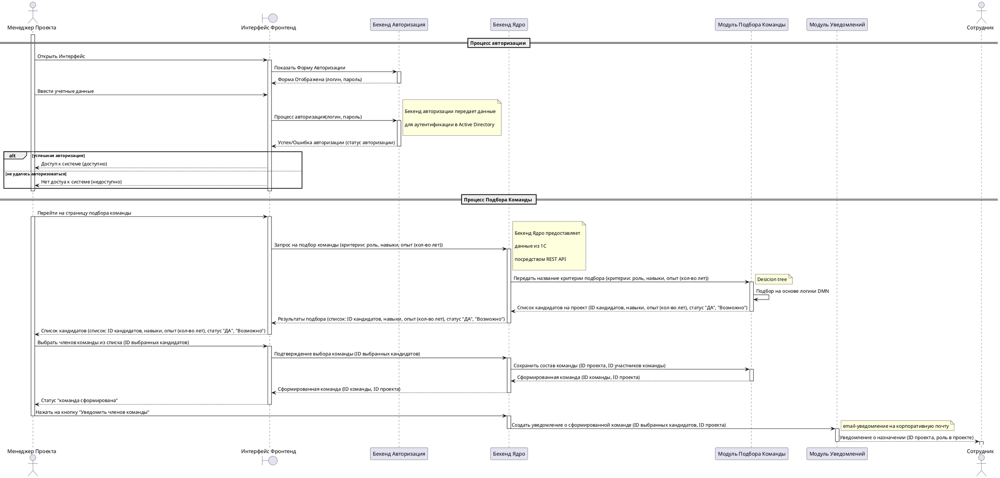

# Сценарий подбора команды на проект

## Описание алгоритма

## **1. Процесс авторизации**

1. **Менеджер проекта** открывает интерфейс (frontend).
2. **Интерфейс фронтенд (UI)** показывает форму авторизации.
   - В форме указаны поля для ввода логина и пароля.
3. **Менеджер проекта** вводит учетные данные (логин и пароль) через интерфейс.
4. **Интерфейс фронтенд (UI)** отправляет данные (логин и пароль) на сервер авторизации (`Бекенд Авторизации`) для проверки.
5. **Сервер авторизации** проверяет учетные данные:
   - Проверка осуществляется с помощью связи с Active Directory.
6. Сервер авторизации отвечает интерфейсу с результатом:
   - **Успешная авторизация:** Интерфейс сообщает **Менеджеру проекта**, что доступ к системе предоставлен.
   - **Ошибка авторизации:** Интерфейс сообщает, что доступ к системе отсутствует.

---

## **2. Процесс подбора команды**

### Переход к странице подбора команды
1. **Менеджер проекта** переходит на страницу подбора команды через интерфейс.
2. **Интерфейс фронтенд (UI)** отправляет запрос на сервер **Ядро (core)** для подбора команды с параметрами:
   - Роль сотрудников.
   - Навыки.
   - Опыт (количество лет).
3. **Сервер Ядро (core)** получает запрос и передает данные о критериях на модуль **Модуль Подбора Команды**.

### Подбор кандидатов
4. **Модуль Подбора Команды (team_module)** выполняет логику подбора кандидатов с использованием Decision Model Notation (DMN).
   - **team_module** определяет кандидатов на основе указанных критериев.
5. **Модуль Подбора Команды (team_module)** возвращает результаты поиска:
   - Список кандидатов с их навыками, опытом и статусом (ДА / Возможно).
6. **Сервер Ядро (core)** возвращает результаты подбора через интерфейс фронтенд (UI).

### Выбор команды
7. **Менеджер проекта** выбирает сотрудников из предложенного списка кандидатов через интерфейс.
8. **Интерфейс фронтенд (UI)** отправляет подтверждение выбора команды на сервер **Ядро (core)**.
9. **Сервер Ядро (core)** передает информацию о выбранной команде обратно в модуль **Модуль Подбора Команды (team_module)** для сохранения данных.
10. **Модуль Подбора Команды (team_module)** сохраняет состав команды:
    - Связывание ID команды с ID сотрудников и проектом.
11. Сервер отправляет подтверждение о сформированной команде обратно в интерфейс фронтенд (UI).

---

## **3. Уведомление сотрудников**

### Создание уведомления
12. **Менеджер проекта** нажимает кнопку в интерфейсе для отправки уведомлений команде.
13. **Сервер Ядро (core)** отправляет запрос на модуль **Модуль Уведомлений (notifications)** для создания уведомлений.
14. **Модуль Уведомлений** генерирует уведомления по созданию команды и отправляет их сотрудникам.
15. **Сотрудники (employee)** получают уведомления по корпоративной почте:
    - Содержит информацию о назначении в проект, роли и ID проекта.

---

### Итоговая последовательность шагов:
1. Менеджер Проекта:
   - Открывает интерфейс.
   - Авторизуется.
   - Переходит к подбору команды.
2. Интерфейс UI отправляет запросы на серверы.
3. Серверы обрабатывают запросы:
   - Проверка учетных данных.
   - Поиск кандидатов.
   - Сохранение данных о новой команде.
4. Уведомления отправляются сотрудникам.
